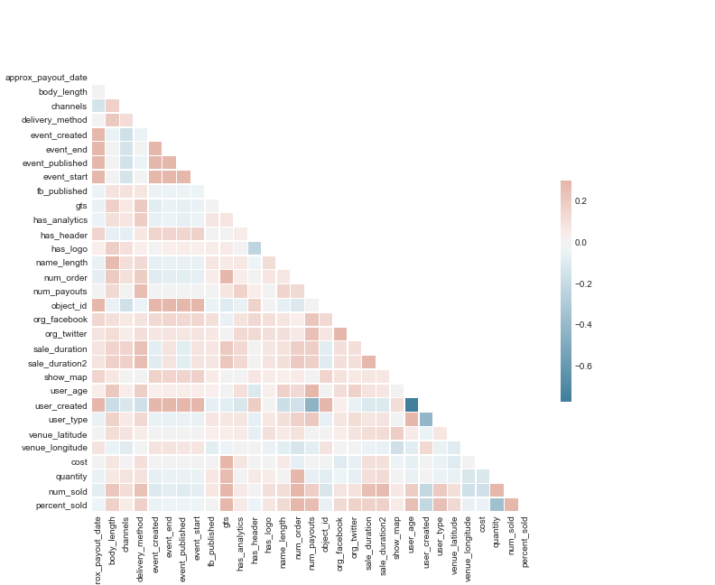
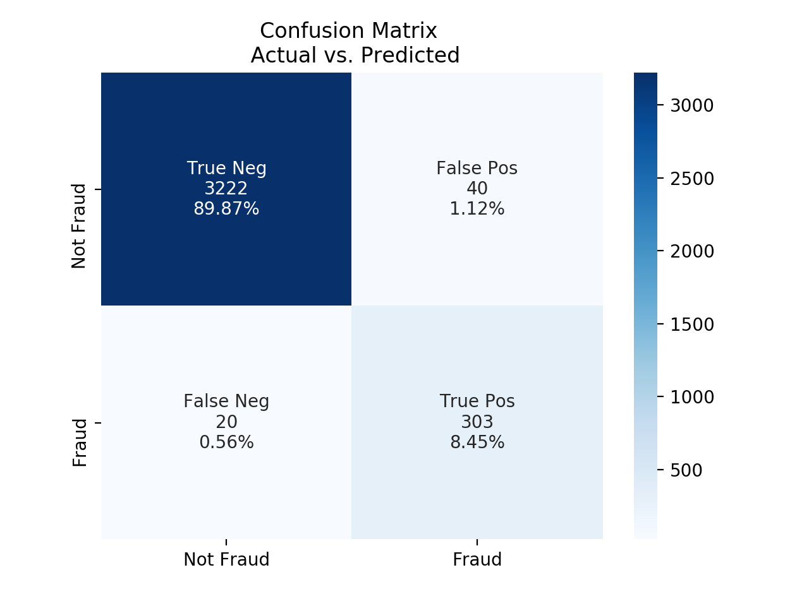
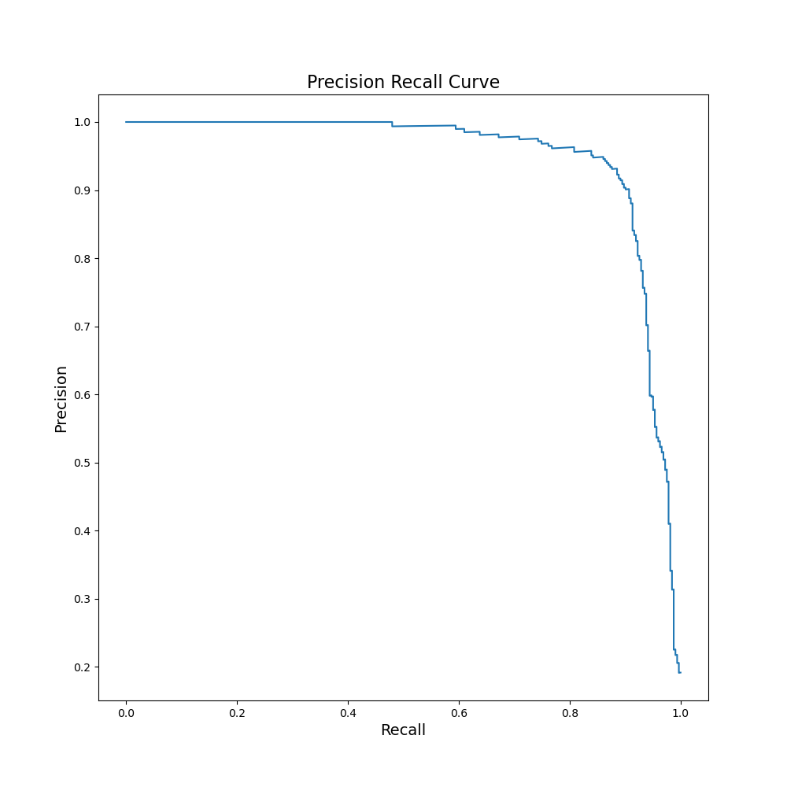

# Detection of fraudulent event submissions

## Overview

This project implements a random forest classification model to predict whether events submitted to an event website are real or fraudulent events.  The events are pulled from an API and stored in a Postgres database and displayed using a Flask app.

## Table of Contents

* [Data sources and EDA](#data-EDA-cleaning)
* [API and database implementation](#API-and-database-implementation)
* [Modeling](#Modeling)
* [Results](#Results)
* [Web app](#web-app)
* [Code overview](code-overview)

## Data, EDA, cleaning

A set of sample data was obtained containing around 14,000 events with various tags for the type of event including the following fields:

```
'acct_type', 'approx_payout_date', 'body_length', 'channels', 'country',
'currency', 'delivery_method', 'description', 'email_domain',
'event_created', 'event_end', 'event_published', 'event_start',
'fb_published', 'gts', 'has_analytics', 'has_header', 'has_logo',
'listed', 'name', 'name_length', 'num_order', 'num_payouts',
'object_id', 'org_desc', 'org_facebook', 'org_name', 'org_twitter',
'payee_name', 'payout_type', 'sale_duration', 'sale_duration2',
'show_map', 'user_age', 'user_created', 'user_type', 'venue_address',
'venue_country', 'venue_latitude', 'venue_longitude', 'venue_name',
'venue_state'
```

Rather than using one hot encoding to integrate categorical features, we first used the numerical fields after filling NA values with either the mean of the field, or in some cases such as lat and long, with zeros.

In total, we utilized 22 features:

```
'body_length',
'channels',
'delivery_method',
'event_created',
'event_end',
'event_published',
'event_start',
'fb_published',
'has_analytics',
'has_header',
'has_logo',
'name_length',
'object_id',
'org_facebook',
'org_twitter',
'sale_duration',
'show_map',
'user_age',
'user_created',
'user_type',
'venue_latitude',
'venue_longitude'
```

The data also had two nested groups of data, ticket types and previous payouts.  Some of these fields we realized did not exist in the API data and so represented potential leakage that would then not assist us in production since it would not have those features available to the model.  However, previous payouts was available from the API and potentially represented a rich set of features that might indicate fraudulent events - if the vendor had previous been paid for real events, it is probably less likely they are creating fraudulent events.  An example of this data is:

```
name              created country  amount state address      uid    event zip_code  object_id
689002       2013-07-29 03:11:41      US  256.64         3211379  6530523             5620016
```

From ticket types, we utilized quantity of tickets available, and cost of each ticket.


We examined relationships between features and found that they were mostly not correlated with eachother:

<br>
<p align="center">

</p>
<br>

### API and database implementation

We setup a cloud instance (EC2) on Amazon Web Services (AWS) and instantiated a postgres SQL server.  After setting up a database schema, we directed the API client to save new data to the postgres database.  We also installed python, flask and other components to enable the flask app (discussed below) to be hosted from the same instance.

## Modeling

### Accuracy metrics selected
We selected the F1 score: harmonic mean of recall and precision as our metric for model selection since the classes were imbalanced in the training data (we only had 9 % of the data as fraudulent events).  We also wanted to make sure we did not have too many false negatives, since those would be potentially costly for the business.

### Validation methodology

During our initial exploration of our data we expected, and quickly realized, that we were dealing with imbalanced classes. Only 9% of the transactions coming through were being labeled as Fraudulent. In order to combat this we decided to oversample our fraudulent transactions during the training process so our model was seeing a higher ratio of fraud. which helped our model from just guessing the majority class. Other techniques that were attempted were SMOTE and undersampling of the majority class, neither yielded the same results as oversampling.
 
With the imbalanced classes we had during our test phase we knew accuracy would not be the best metric to evaluate our model. We chose to look at the F1 score, which is the harmonic mean of recall and precision of our results from our random forest classifier model.

<br>
<p align="center">

</p>
<br>

### Flagging Fraud
Once our model was trained and ready to predict on the data we were able to gather from the API we utilized `.predict_proba` and created new columns with the probability that transaction was fraudulent. 

### ROC
Since ROC is not the best tool to examine model performance when we are interested in false negative rate, we utilized a precision recall plot to demonstrate our model performance:

<br>
<p align="center">

</p>
<br>

##  Web app
We developed and host a web app to enable review of the data and the model predictions.  This web app is implemented in python using Flask.

## Code overview
* in `src/load_json_to_db.py` loads the original data into these tables:
    - `original_data`
    - `org_ticket_types`
    - `org_previous_payouts`

* Then `api_client.py` can be run and will keep adding rows to these tables:
    - `api_data`
    - `ticket_types`
    - `previous_payouts`

* The model is created in `train_model.py` and implemented on API data in `final_api_run.py`

* The second and third tables were nested json and were broken out.  Each table has `object_id` (and in the original data table it is the primary key).  The second and third tables have multiple rows for `object_id` and were aggregated in `final_api_run.py`.

* `api_data` actually has some columns that aren't in the API data and could be updated later: `acct_type` and `approx_payout_date`.  In addition, the api doesn't send data for these cols: `gts`, `num_order`, `num_payout`. Also of note, the api data has a `sequence_number` that the original data doesn't have.
