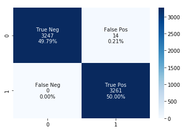
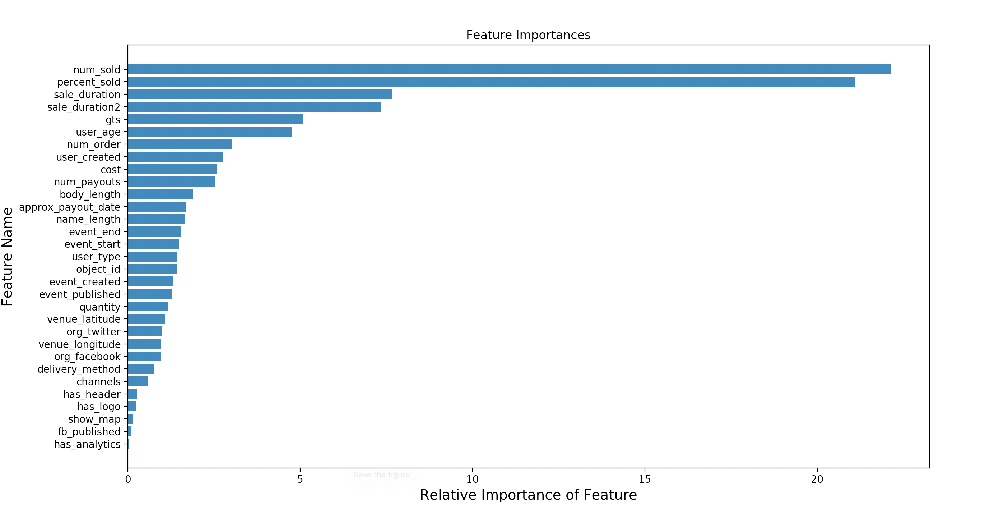
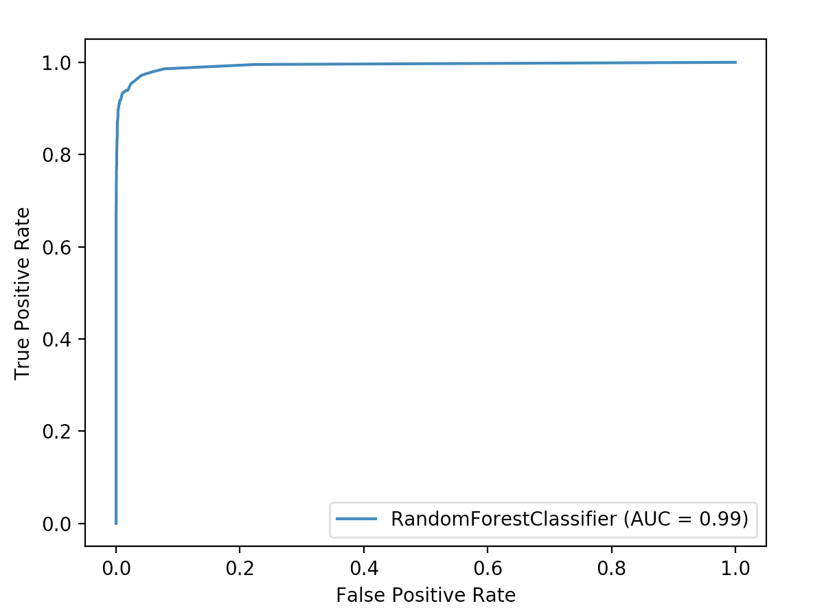

<!--# Fraud Detection Case Study

For the next two days we will work with the entire end to end pipeline of data science through a case study.  We have touched on aspects of this throughout the course but have not yet put all the pieces together.

Topics included in this case study include:
* Classification modeling.
* Programming Practice: Handing off models. 
* Teamwork.
* Web applications.
* Website hosting with AWS
* Deploying a DS application.
* Data visualization.
* Results presentation.

#### Rough timeline 

* Day 1: Project scoping, Team direction, Model building
* Day 2: Web app and deployment

#### Deliverables

We will want two deliverables from you for this project:

* A dashboard for investigators to use which helps them identify new events that are worthy of investigation for fraud.  This will pull in new data regularly, and update a useful display for the investigation team.  How you wish to lay this out is up to you.
* A ten-minute presentation on your process and results. 

#### Notes

* [Overview](overview.md): gives a detailed overview of the project.  Included are *suggestions* for how you can organize your team, though this is not binding, and you are free to deviate.
* [Building your model](model_notes.md): notes on how to get started with the dataset and how to save your model once you've trained it.
-->
## Cleaning Pipeline:
We chose to use all numerical features. We filled nans with with the mean of the column except for the longitude and latitude column which we filled with 0.

We also took the ```ticket_types``` column and made new columns assosiated with averge ticket cost, total quantity of tickets, tot tickets sold and ratio of sold to quantity.

This left us with 31 features. 

# Model
## Accuracy metrics selected
f1 score: harmonic mean of recal and precision. We chose this becasue the classes were imbalenced. We wanted to make sure we did not have too many false negatives.


<!--We split the data frame into train and test sets with with stratification to make sure we have the same ratio of fraud cases in train and test. We  fit our model with the train set, then use the test set to get a score for the model.-->
## Validation and Testing Methodology
We split our dataset into train and test set stratifying to make sure we have the same ratio of fraud to to not fraud in both sets. We also oversampled the training dataset so there was a higher ratio of fraud in the traing so that the model would not just guess all in the majority class. We tried useing SMOTE technique instead of oversampleing but decided to stick woth oversampleing. 

We found a random forest classifier model to be the best performing model. It got an f1 score **99.7** on test data.



### Feature Importances
Here are the features:


### Correlation Plots
our features mostly are correlated


### ROC (is awesome)
ROC plot:



##  Building Database and App
We setup an AWS EC2 instance here displaying our [results](http://52.15.236.214:33507/analysis)
We created a postgres database and integration of the model predictions and data from the API is being completed.

We don't like nested dictionaries in dataframes :disappointed: :thumbsdown:

# Comparing Fraud and Not Fraud Examples
We found that many of the numerical variable means were different between the two groups:

| Fraud   |   approx_payout_date |   body_length |   channels |   delivery_method |   event_created |   event_end |   event_published |   event_start |   fb_published |     gts |   has_analytics |   has_header |   has_logo |   name_length |   num_order |   num_payouts |   object_id |   org_facebook |   org_twitter |   sale_duration |   sale_duration2 |   show_map |   user_age |   user_created |   user_type |   venue_latitude |   venue_longitude |
|:--------|---------------------:|--------------:|-----------:|------------------:|----------------:|------------:|------------------:|--------------:|---------------:|--------:|----------------:|-------------:|-----------:|--------------:|------------:|--------------:|------------:|---------------:|--------------:|----------------:|-----------------:|-----------:|-----------:|---------------:|------------:|-----------------:|------------------:|
| False   |          1.35125e+09 |       3886.99 |       6.38 |              0.48 |     1.34587e+09 | 1.35082e+09 |       1.34291e+09 |   1.35054e+09 |           0.14 | 2481.68 |            0.08 |         0.21 |       0.86 |         42.78 |       30.34 |         37.04 | 4.51462e+06 |           8.63 |          4.69 |           49.83 |            53.95 |       0.85 |     402.68 |    1.31108e+09 |        2.82 |            35.17 |            -60.69 |
| True    |          1.34769e+09 |       1508.89 |       4.15 |              0.07 |     1.34533e+09 | 1.34726e+09 |       1.31854e+09 |   1.34678e+09 |           0.02 | 1911.21 |            0    |         0.07 |       0.65 |         29.98 |        4.53 |          0.58 | 4.70004e+06 |           1.04 |          0.29 |           14.13 |            16.54 |       0.76 |      87.15 |    1.3378e+09  |        1.62 |            35.97 |            -43.41 |


## Flagging Fraud
Since our model did so well with identifying fraud we looked at the ```.predict_proba``` from our hold out data. We realized that the threshold our model created was very high to be marked as fraud so we decided to have the follow threshold for HIGH, MEDIUM, LOW risk:

If 0.95 < predict_proba < 1 = HIGH
If 0.95 <= predict_prob = MEDIUM
If 0.91 <= predict_prob = LOW

# Next steps
Bring together all the components into a working, interactive flask app.

## notes on the code:
* in `src/load_json_to_db.py` loads the original data into these tables:
    - `original_data`
    - `org_ticket_types`
    - `org_previous_payouts`

* The second and third tables were nested json and were broken out.  Each table has `object_id` (and in the original data table it is the primary key).  The second and third tables have multiple rows for `object_id` and will be aggregated later.

* Then `api_client.py` can be run and will keep adding rows to these tables:
    - `api_data`
    - `ticket_types`
    - `previous_payouts`

* `api_data` actually has some columns that aren't in the API data and could be updated later: `acct_type` and `approx_payout_date`.  Also of note, the api data has a `sequence_number` that the original data doesn't have.

